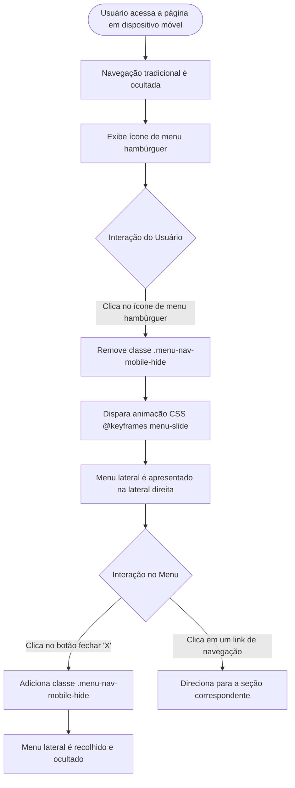

# 📰 News Homepage — Frontend Mentor Challenge

<br />

<div align="center">
  
</div>

<br />

<div align="center">

[](https://new-homepage-xi.vercel.app/)
[](https://www.frontendmentor.io/challenges/news-homepage-H6SWTa1MFl)
[](https://developer.mozilla.org/pt-BR/docs/Web/HTML)
[](https://developer.mozilla.org/pt-BR/docs/Web/CSS)
[](https://developer.mozilla.org/pt-BR/docs/Web/JavaScript)
[](LICENSE)
[](#)

</div>

---

## 🔗 Demonstração ao Vivo (Deploy)

A aplicação está publicada e em execução contínua na **Vercel**:

👉 **[Acesse a News Homepage Online](https://new-homepage-xi.vercel.app/)**

* **Solução no Frontend Mentor:** [Desafio News Homepage no Frontend Mentor](https://www.frontendmentor.io/challenges/news-homepage-H6SWTa1MFl)
* **Perfil do Autor:** [@erickystn no Frontend Mentor](https://www.frontendmentor.io/profile/erickystn)

---

## 📖 Visão Geral

A **News Homepage** é uma página de portal de notícias moderna, totalmente responsiva e acessível, desenvolvida como solução ao desafio de nível intermediário da plataforma **[Frontend Mentor](https://www.frontendmentor.io/)**.

O objetivo do projeto é reproduzir com fidelidade de pixel (*pixel perfection*) o layout proposto no design original, empregando práticas avançadas de **HTML5 Semântico**, **CSS3 Moderno** (com Flexbox, variáveis personalizadas em `:root` e regras de animação `@keyframes`), além de **JavaScript Vanilla** para controle do menu lateral animado (*Drawer Navigation*) em dispositivos móveis.

A aplicação adota uma abordagem de design responsivo com múltiplos pontos de quebra (*breakpoints*), adaptando fluidamente a distribuição de colunas e cartões tanto para telas ultra-largas (Desktop 1440px) quanto para tablets (768px) e smartphones compactos (375px).

---

## ✨ Funcionalidades

* **Cabeçalho com Navegação Inteligente:**
  * Barra de navegação horizontal no desktop com links estilizados (`Home`, `New`, `Popular`, `Trending`, `Categories`).
  * Botão hambúrguer no mobile que aciona um menu lateral (*Off-canvas drawer*) deslizante com botão de fechar (`icon-menu-close.svg`).
* **Seção Principal em Destaque (Hero Section):**
  * Banner visual de impacto (`image-web-3-desktop.jpg` / `image-web-3-mobile.jpg`).
  * Título tipográfico de destaque (*"The Bright Future of Web 3.0?"*), resumo analítico e botão de ação primário (*"Read More"*) com transições cromáticas interativas.
* **Coluna de Notícias Recentes ("New"):**
  * Bloco vertical com fundo em contraste escuro (*Very Dark Blue*), agrupando manchetes em tempo real com divisores sutis e destaques tipográficos em tom laranja suave (*Soft Orange*).
* **Grid de Artigos em Destaque (Cards Inferiores):**
  * Três cartões informativos com numeração sequencial estilizada (`01`, `02`, `03`), miniaturas proporcionais e títulos com efeitos de *hover*:
    * `01 - Reviving Retro PCs`: O que acontece quando computadores clássicos recebem melhorias modernas.
    * `02 - Top 10 Laptops of 2022`: Seleção de equipamentos para diversas necessidades e orçamentos.
    * `03 - The Growth of Gaming`: Como novos hábitos impulsionaram o mercado de jogos eletrônicos.
* **Acessibilidade e Performance:**
  * Reset CSS compatível com a diretiva de acessibilidade `prefers-reduced-motion` para usuários que desativam animações no sistema operacional.

---

## 🎯 Diferenciais e Destaques Técnicos

1. **Variáveis Nativas de CSS (`Custom Properties`):** Toda a paleta cromática do projeto é centralizada na pseudo-classe `:root`, permitindo manutenibilidade e consistência visual imediata em todo o documento.
2. **Escala Tipográfica com Unidades Relativas (`rem`):** Definição da fonte raiz em `html { font-size: 62.5%; }`, estabelecendo que `1rem = 10px`, facilitando a conversão de medidas e o escalonamento proporcional do texto.
3. **Animação Fluida de Menu Lateral:** O menu mobile utiliza animação de transição nativa em CSS (`@keyframes menu-slide 300ms linear`) para realizar o deslocamento lateral (*translateX*) suave ao abrir.
4. **Manipulação Leve do DOM com Vanilla JavaScript:** Controle do estado visual do menu através de classes utilitárias (`.menu-nav-mobile-hide`) sem a necessidade de frameworks ou bibliotecas adicionais, garantindo carregamento ultrarrápido (0 dependências de runtime).
5. **Reset CSS Defensivo e Acessível:** Normalização de margens, modelo de caixa universal (`box-sizing: border-box`), tratamento otimizado de renderização de texto (`text-rendering: optimizeSpeed`) e supressão de animações sob `prefers-reduced-motion`.

---

## 🏗️ Arquitetura e Estrutura de Pastas

```bash
news-homepage/
├── .gitignore                                 # Regras de exclusão do Git (arquivos de design, .DS_Store)
├── index.html                                 # Estrutura semântica principal da aplicação
├── README.md                                  # Documentação técnica e guia do projeto
├── style-guide.md                             # Especificação do guia de estilos oficial do Frontend Mentor
├── assets/
│   ├── css/
│   │   ├── reset.css                          # Reset global de regras e diretivas de acessibilidade
│   │   └── style.css                          # Estilos principais, variáveis CSS, layout Flexbox e media queries
│   ├── fonts/
│   │   ├── README.txt                         # Informações de licença da tipografia Inter
│   │   ├── Inter-VariableFont_slnt,wght.ttf   # Fonte variável Inter
│   │   └── static/                            # Arquivos TTF estáticos (Regular, Bold, ExtraBold)
│   ├── images/
│   │   ├── favicon-32x32.png                  # Ícone da aba do navegador
│   │   ├── logo.svg                           # Logomarca vetorial do portal de notícias
│   │   ├── icon-menu.svg                      # Ícone do botão hambúrguer do menu mobile
│   │   ├── icon-menu-close.svg                # Ícone de fechar do menu mobile
│   │   ├── image-web-3-desktop.jpg            # Imagem do banner principal em alta resolução
│   │   ├── image-web-3-mobile.jpg             # Imagem do banner principal adaptada para mobile
│   │   ├── image-retro-pcs.jpg                # Imagem do artigo 01
│   │   ├── image-top-laptops.jpg              # Imagem do artigo 02
│   │   └── image-gaming-growth.jpg            # Imagem do artigo 03
│   └── js/
│       └── script.js                          # Lógica interativa de abertura/fechamento do menu mobile
└── design/
    ├── screenshot-desktop.JPG                 # Captura de tela da versão Desktop (1440px)
    ├── screenshot-mobile.jpg                  # Captura de tela da versão Mobile (375px)
    └── screenshot-mobile-menu.jpg             # Captura de tela do menu lateral aberto no mobile
```

---

## 🎨 Sistema de Design e Guia de Estilos

### Paleta de Cores

| Cor | Formato HSL | Papel na Interface |
| :--- | :--- | :--- |
| **Soft Orange** | `hsl(35, 77%, 62%)` | Títulos secundários da seção "New" e estados de foco/hover. |
| **Soft Red** | `hsl(5, 85%, 63%)` | Botão principal "Read More", links ativos e títulos em hover. |
| **Off-white** | `hsl(36, 100%, 99%)` | Textos na coluna escura e plano de fundo do menu mobile. |
| **Grayish Blue** | `hsl(233, 8%, 79%)` | Numeração de destaques (`01`, `02`, `03`) e textos de apoio. |
| **Dark Grayish Blue** | `hsl(236, 13%, 42%)` | Parágrafos informativos e links da barra de navegação. |
| **Very Dark Blue** | `hsl(240, 100%, 5%)` | Fundo da coluna lateral "New" e tipografia dos títulos principais. |

### Tipografia e Breakpoints
* **Família:** [Inter](https://fonts.google.com/specimen/Inter) (Pesos: `400` Regular, `700` Bold, `800` ExtraBold).
* **Breakpoints Responsivos:**
  * **Desktop:** $> 768px$ (largura máxima centralizada em `144rem`).
  * **Tablet:** $\le 768px$ (ajustes de proporção de texto e espaçamentos no Hero).
  * **Mobile:** $\le 660px$ (conversão do layout para coluna única e ativação do menu gaveta).

---

## 🔄 Fluxo de Navegação e Interatividade do Menu



---

## 📸 Demonstração e Telas da Aplicação

<details open>
<summary><b>🖥️ Visualização Desktop (1440px)</b></summary>

<br />

<div align="center">
  
</div>

</details>

<br />

<details>
<summary><b>📱 Visualização Mobile e Menu Lateral (375px)</b></summary>

<br />

| Página Inicial Mobile | Menu Lateral Aberto |
| :---: | :---: |
|  |  |

</details>

---

## 📖 Passo a Passo de Uso

1. **Acessar a Aplicação:** Abra o [Link de Demonstração na Vercel](https://new-homepage-xi.vercel.app/) ou execute localmente o arquivo `index.html`.
2. **Explorar os Destaques:**
   * Leia a matéria principal sobre a evolução da Web 3.0 e interaja com o botão **Read More**.
   * Observe as notícias recentes na coluna **New** à direita, passando o cursor sobre as manchetes para visualizar as transições de cor.
   * Navegue pelas matérias numeradas na seção inferior (`01`, `02` e `03`).
3. **Interagir no Dispositivo Móvel:**
   * Ao redimensionar a tela ou acessar por um smartphone, clique no ícone hambúrguer no canto superior direito para abrir a gaveta de navegação.
   * Feche o menu clicando no ícone de **X** no canto superior do painel.

---

## 🎓 Objetivo do Projeto

Construído para colocar em prática os padrões contemporâneos de desenvolvimento web front-end sem a sobrecarga de ferramentas externas, demonstrando:
* Arquitetura de estilização limpa e modular com separação entre reset global e estilos temáticos.
* Domínio de **Flexbox** para layouts fluidos e bidimensionais.
* Integração de tipografias variáveis e controle de acessibilidade com `prefers-reduced-motion`.
* Manipulação imperativa de classes do DOM via eventos do JavaScript.

---

## ⚙️ Requisitos e Instalação

### Pré-requisitos
* Qualquer navegador web moderno (Google Chrome, Mozilla Firefox, Safari, Microsoft Edge).
* [Git](https://git-scm.com/) para clonagem do repositório.

### Instalação

1. Clone o repositório em sua máquina:
```bash
git clone https://github.com/erickystn/news-homepage.git
```

2. Entre no diretório do projeto:
```bash
cd news-homepage
```

---

## 🚀 Como Executar

Por ser uma aplicação baseada em tecnologias web nativas (HTML, CSS e JavaScript puros), não requer etapa de compilação ou instalação de pacotes:

### Opção 1: Diretamente no Navegador
Abra o arquivo `index.html` com duplo clique ou arraste-o para a janela do seu navegador preferido.

### Opção 2: Via Servidor Local (Live Server / Node / Python)

* **Utilizando a extensão Live Server (VS Code):**
  Clique com o botão direito sobre `index.html` e selecione *"Open with Live Server"*.

* **Utilizando Node.js (npx serve):**
  ```bash
  npx serve .
  ```

* **Utilizando Python:**
  ```bash
  python3 -m http.server 8000
  ```
  Acesse no navegador: `http://localhost:8000`

---

## 💻 Exemplos de Código

### 1. Manipulação do Menu Mobile (`assets/js/script.js`)
```javascript
const buttonClose = document.querySelector(".menu-close");
const menuOpen = document.querySelector(".menu-mobile-icon");
const menuNavMobile = document.querySelector(".menu-nav-mobile");

buttonClose.addEventListener("click", () => {
  menuNavMobile.classList.add("menu-nav-mobile-hide");
});

menuOpen.addEventListener("click", () => {
  menuNavMobile.classList.remove("menu-nav-mobile-hide");
});
```

---

### 2. Animação Deslizante com Keyframes (`assets/css/style.css`)
```css
.menu-nav-mobile {
  position: fixed;
  top: 0;
  right: 0;
  width: 70vw;
  height: 100vh;
  background-color: var(--secondary-off-white);
  animation: menu-slide 300ms linear 0s 1 normal forwards;
}

@keyframes menu-slide {
  0% {
    opacity: 0;
    transform: translateX(70%);
  }
  100% {
    opacity: 1;
    transform: translateX(0);
  }
}
```

---

## 🧪 Suíte de Testes e Validação

O projeto foi validado por meio de:
1. **Auditoria de Responsividade:** Testado em múltiplos viewports reais e emulados via DevTools (Desktop 1440px, Tablet 768px, Mobile 375px e 320px).
2. **Compatibilidade Cross-browser:** Verificado em navegadores baseados em Chromium, Gecko (Firefox) e WebKit (Safari).
3. **Acessibilidade:** Verificação de contraste de cores nas paletas HSL e suporte à preferência de redução de movimento.

---

## 🛠️ Tecnologias Utilizadas

| Tecnologia | Finalidade no Projeto |
| :--- | :--- |
| **[HTML5](https://developer.mozilla.org/pt-BR/docs/Web/HTML)** | Marcação semântica da página (`header`, `main`, `section`, `nav`, `footer`). |
| **[CSS3](https://developer.mozilla.org/pt-BR/docs/Web/CSS)** | Estilização avançada com Flexbox, variáveis CSS, transições e animações `@keyframes`. |
| **[JavaScript (Vanilla)](https://developer.mozilla.org/pt-BR/docs/Web/JavaScript)** | Manipulação do DOM para abertura e fechamento interativo do menu mobile. |
| **[Inter Font](https://fonts.google.com/specimen/Inter)** | Tipografia primária moderna aplicada em todos os elementos da página. |
| **[Vercel](https://vercel.com/)** | Plataforma de hospedagem e deploy contínuo (*Continuous Deployment*). |
| **[Frontend Mentor](https://www.frontendmentor.io/)** | Fornecedor das especificações de design, imagens e ativos originais do desafio. |

---

## 📈 Melhorias e Próximos Passos (Roadmap)

- [ ] **Acessibilidade ARIA:** Incluir atributos como `aria-expanded` e `aria-controls` no botão do menu hambúrguer para leitores de tela.
- [ ] **Transição de Fechamento Suave:** Implementar animação reversa para o fechamento do menu antes da aplicação de `display: none`.
- [ ] **Overlay Escuro (Backdrop):** Adicionar uma camada semitransparente de fundo ao abrir o menu mobile para focar a atenção na gaveta lateral.
- [ ] **Carregamento Dinâmico de Notícias:** Conectar a seção de notícias a uma API pública externa de notícias em tempo real.
- [ ] **Tema Claro / Escuro:** Implementar seletor de temas aproveitando as variáveis CSS de `:root`.

---

## 🤝 Como Contribuir

1. Faça um **Fork** do repositório.
2. Crie uma nova branch com sua contribuição:
   ```bash
   git checkout -b feature/minha-melhoria
   ```
3. Commit suas modificações com mensagens claras:
   ```bash
   git commit -m "feat: adiciona backdrop escuro ao abrir o menu mobile"
   ```
4. Envie suas alterações:
   ```bash
   git push origin feature/minha-melhoria
   ```
5. Abra um **Pull Request** detalhado para revisão.

---

## 👤 Autor & Créditos

* **Desenvolvedor:** [Ericky Santana](https://github.com/erickystn/)
* **Perfil Frontend Mentor:** [@erickystn](https://www.frontendmentor.io/profile/erickystn)
* **Desafio Oficial:** [Frontend Mentor - News Homepage](https://www.frontendmentor.io/challenges/news-homepage-H6SWTa1MFl)

---

## 📄 Licença

Este projeto está sob a licença **MIT**. Consulte o arquivo de licença ou sinta-se à vontade para estudar, clonar e aprimorar o código.
